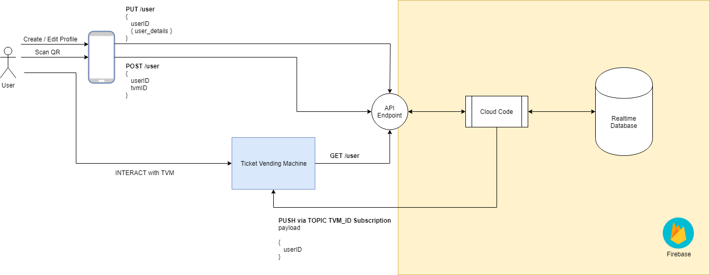

# Shortcut
Making Ticket Vending Machines more accessible for all.

The project came to inception during HackTrain 5.0, with the aim of creating a product which tackles customer service and user experience in the rail industry. Something that we've all experienced is the frustrating and confusing experience of buying train tickets at stations. The DFT (Department For Transport) has commisioned many studies for this they found that there was a high rate of user failures and the lack accessibility for disabled users when purchasing at ticketing machines (more in the useful links section). Tom came up with a novel solution to improve the ticket machine purchasing experience without the use of additional hardware with the aim of reducing the number of steps to purchase a ticket.

This project started as the output of a HackTrain5: https://twitter.com/thehacktrain?lang=en

More about Shortcut be found her: https://devpost.com/software/chhhchhhchhhhhh

## What Shortcut Does
By using the common solution of QR codes we're able to quickly identify which ticket machine a user is trying to use and therefore load the users preferences directly to the ticket machine itself - including: accessibility details, favourite destinations and railcards. This allows us to customise the ticket machine user experience and therefore reduces the ticket purchasing steps from 9 to 4.

## How We Built It
We built Shortcut with usability in mind. Heidi our designer used her experience to create a design that is both familiar to existing users but also strips away the annoying parts of purchasing a ticket.

The technical solution designed by Kevin is elegant and keeps in mind security and data privacy by only transmitting non-sensitive data across the internet (i.e. userId).

Slides: link

## Technical Specification
This project uses:
 - NodeJS
 - React-Native
 - HTML/CSS
 - Firebase [https://firebase.google.com/]

## Useful Links
ORR passenger rail usage: http://orr.gov.uk/__data/assets/pdf_file/0014/28013/passenger-rail-usage-2017-18-q4.pdf

ORR (2017) Ticket Vending Machines Review: February 2017 http://orr.gov.uk/__data/assets/pdf_file/0018/24048/ticket-vending-machines-review-february-2017.pdf

Department for Transport (2017) Action Plan: Information on Rail Fares & Ticketing Progress Report: https://assets.publishing.service.gov.uk/government/uploads/system/uploads/attachment_data/file/669746/action-plan-information-on-rail-fares-ticketing.pdf

RDG (2016) Ticket Vending Machines: Design Guidelines
https://www.raildeliverygroup.com/about-us/publications.html?task=file.download&id=469771183

ORR (2017) Research into Passengers’ experience of Ticket Vending Machines: http://orr.gov.uk/__data/assets/pdf_file/0016/24046/research-into-passengers-experience-of-ticket-vending-machines-february-2017.pdf

Transport Focus (2010) Ticket Vending Machine Usability: Qualitative Research https://www.transportfocus.org.uk/research-publications/publications/ticket-vending-machine-usability-qualitative-research/

DWP Family Resources Survey (2015/16): https://assets.publishing.service.gov.uk/government/uploads/system/uploads/attachment_data/file/600465/family-resources-survey-2015-16.pdf

There are numerous legal and policy frameworks which are in place to help ensure that rail transport is accessible:

 - Equality Act 2010
 - Accessible rail stations: design standards code of practice
 - Disabled Peoples’ Protection Policy
 - Access for All
 - Railways (Interoperability) Regulations 2011
 - Rail Vehicle Accessibility (Non Interoperable Rail System)
 - Regulations 2010

For information on users with disabilities particular problems with TVMs have a look at page 44 onwards of the transport focus report https://www.transportfocus.org.uk/research-publications/publications/ticket-vending-machine-usability-qualitative-research/#